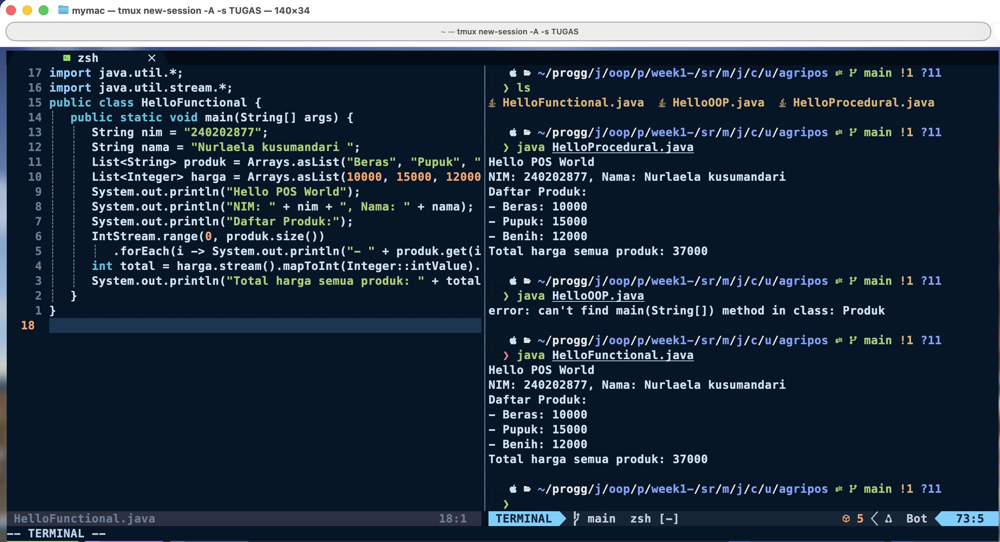

# Laporan Praktikum Minggu 1

Topik: Paradigma prosedural, OOP, dan fungsional

## Identitas

- Nama : Nurlaela kusumandari
- NIM : 240202877
- Kelas : 3IKKA

---

## Tujuan

- Mahasiswa mampu mendefinisikan paradigma prosedural, OOP, dan fungsional.
- Mahasiswa mampu membandingkan kelebihan dan keterbatasan tiap paradigma.
- Mahasiswa mampu memberikan contoh program sederhana untuk masing-masing paradigma.

---

## Dasar Teori

1. Class adalah blueprint dari objek.
2. Object adalah instansiasi dari class.
3. Enkapsulasi digunakan untuk menyembunyikan data.

---

## Langkah Praktikum

1. **Setup Project**
   - Pastikan sudah menginstall **JDK** (Java Development Kit), **IDE** (misal: IntelliJ IDEA, VS Code, NetBeans), **Git**, **PostgreSQL**, dan **JavaFX** di komputer.
   - Buat folder project `oop-pos-<nim>`.
   - Inisialisasi repositori Git.
   - Buat struktur awal `src/main/java/com/upb/agripos/`.
   - Pastikan semua tools dapat berjalan (uji dengan membuat dan menjalankan program Java sederhana).

2. **Program Sederhana dalam 3 Paradigma**
   - Prosedural: program untuk menghitung total harga dua produk.
   - OOP: class `Produk` dengan atribut nama dan harga, buat minimal tiga objek, lalu hitung total.
   - Fungsional: gunakan `Stream` atau lambda untuk menghitung total harga dari minimal tiga objek.

3. **Commit dan Push**
   - Commit dengan pesan: `week1-setup-hello-pos`.

---

## Kode Program HelloOOP.java

```java
// HelloOOP.java
class Produk {
   String nama;
   int harga;
   Produk(String nama, int harga) {
      this.nama = nama;
      this.harga = harga;
   }
}

public class HelloOOP {
   public static void main(String[] args) {
      String nim = "240202877";
      String namaMhs = "Nurlaela kusumandari";
      Produk[] daftar = {
         new Produk("Beras", 10000),
         new Produk("Pupuk", 15000),
         new Produk("Benih", 12000)
      };
      int total = 0;
      System.out.println("Hello POS World");
      System.out.println("NIM: " + nim + ", Nama: " + namaMhs);
      System.out.println("Daftar Produk:");
      for (Produk p : daftar) {
         System.out.println("- " + p.nama + ": " + p.harga);
         total += p.harga;
      }
      System.out.println("Total harga semua produk: " + total);
   }
}
```

## )

## Hasil Eksekusi

## 

## Kode Program Prosedural

```java
// HelloProcedural.java
public class HelloProcedural {
   public static void main(String[] args) {
      String nim = "240202877";
      String nama = "Nurlaela kusumandari";
      String[] produk = {"Beras", "Pupuk", "Benih"};
      int[] harga = {10000, 15000, 12000};
      int total = 0;
      System.out.println("Hello POS World");
      System.out.println("NIM: " + nim + ", Nama: " + nama);
      System.out.println("Daftar Produk:");
      for (int i = 0; i < produk.length; i++) {
         System.out.println("- " + produk[i] + ": " + harga[i]);
         total += harga[i];
      }
      System.out.println("Total harga semua produk: " + total);
   }
}
```

## Hasil Eksekusi

## 

## Kode Program Fungsional

```java
// HelloFunctional.java
import java.util.*;
import java.util.stream.*;
public class HelloFunctional {
   public static void main(String[] args) {
      String nim = "240202877";
      String nama = "Nurlaela kusumandari";
      List<String> produk = Arrays.asList("Beras", "Pupuk", "Benih");
      List<Integer> harga = Arrays.asList(10000, 15000, 12000);
      System.out.println("Hello POS World");
      System.out.println("NIM: " + nim + ", Nama: " + nama);
      System.out.println("Daftar Produk:");
      IntStream.range(0, produk.size())
         .forEach(i -> System.out.println("- " + produk.get(i) + ": " + harga.get(i)));
      int total = harga.stream().mapToInt(Integer::intValue).sum();
      System.out.println("Total harga semua produk: " + total);
   }
}
```

## Hasil Eksekusi

## 

## Analisis

- Program ini bekerja dengan membuat kelas Produk sebagai template yang memiliki variabel nama dan harga serta konstruktor untuk inisialisasi, lalu di kelas utama HelloOOP melalui metode main() mendefinisikan variabel identitas, membuat array objek Produk, melakukan iterasi dengan for-each untuk menampilkan nama dan harga setiap produk sambil menghitung totalnya, kemudian mencetak total harga ke layar melalui eksekusi oleh JVM.
- ini adalah minggu pertama
- Kendala yang saya hadapi pada kode helloOOP java adalah tidak bisa langsung dipanggil kodenya, dan harus dicompile terlebih dahulu dengan perintah `javac nama-file` pada terminal.

---

## Kesimpulan

_Dengan menggunakan class dan object, program menjadi lebih terstruktur dan mudah dikembangkan._

---

## Quiz

1. Apakah OOP selalu lebih baik dari prosedural?
   **Jawaban:** Tidak selalu. OOP lebih baik untuk proyek besar dan kompleks karena memudahkan pengelolaan data dan logika melalui objek, namun untuk program kecil yang sederhana, paradigma prosedural sering kali lebih efisien dan mudah dipahami.

2. Kapan functional programming lebih cocok digunakan dibanding OOP atau prosedural?
   **Jawaban:** Functional programming lebih cocok digunakan saat program membutuhkan banyak operasi matematika, manipulasi data, atau komputasi paralel, karena sifatnya yang stateless dan mendukung immutability, sehingga lebih mudah diuji dan dieksekusi secara bersamaan.

3. Bagaimana paradigma (prosedural, OOP, fungsional) memengaruhi maintainability dan scalability aplikasi?
   **Jawaban:** - Prosedural: mudah untuk proyek kecil, tapi sulit dirawat jika program tumbuh besar. - OOP: meningkatkan maintainability dan scalability karena struktur kode modular dan dapat digunakan ulang. - Fungsional: mudah diuji dan dirawat karena tidak bergantung pada state, cocok untuk sistem yang butuh skalabilitas tinggi.

4. Mengapa OOP lebih cocok untuk mengembangkan aplikasi POS dibanding prosedural?
   **Jawaban:** Karena aplikasi POS (Point of Sale) melibatkan banyak entitas seperti produk, pelanggan, transaksi, dan kasir yang saling berinteraksi. Dengan OOP, setiap entitas dapat direpresentasikan sebagai objek, sehingga kode menjadi lebih terstruktur, mudah dikembangkan, dan dipelihara.

5. Bagaimana paradigma fungsional dapat membantu mengurangi kode berulang (_boilerplate code_)?
   **Jawaban:** Paradigma fungsional menggunakan fungsi sebagai elemen utama dan mendukung konsep higher-order functions serta lambda expression, sehingga logika yang berulang dapat dikemas dalam satu fungsi dan dipanggil kembali tanpa menulis ulang kode yang sama.

## Referensi

- Sebesta, R. W. (2016). Concepts of Programming Languages (11th Edition). Pearson.
- Oracle Java Tutorials: Object-Oriented Programming Concepts
- Bird, R., & Wadler, P. (1988). Introduction to Functional Programming. Prentice Hall.
- Oracle Java Documentation: Functional Programming in Java
- Larman, C. (2004). Applying UML and Patterns: An Introduction to Object-Oriented Analysis and Design. Prentice Hall.
- Hughes, J. (1989). Why Functional Programming Matters. The Computer Journal, 32(2), 98–107.
- Oracle Java Tutorials: Java Object-Oriented Concepts
- Booch, G. (2007). Object-Oriented Analysis and Design with Applications (3rd Edition). Addison-Wesley.
- Oracle Java Tutorials: Classes and Objects
- Bloch, J. (2018). Effective Java (3rd Edition). Addison-Wesley.
- Oracle Java Tutorials: Lambda Expressions
