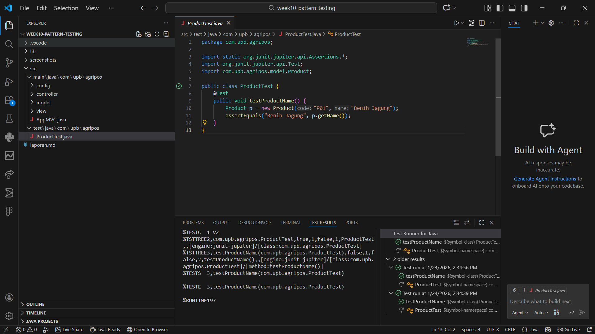

# Laporan Praktikum Minggu 10
Topik: Design Pattern (Singleton, MVC) dan Unit Testing menggunakan JUnit

## Identitas
- Nama  : Nurlaela Kusumandari
- NIM   : 240202877
- Kelas : 3IKKA

---

## Tujuan
1. Menjelaskan konsep dasar design pattern dalam rekayasa perangkat lunak.
2. Mengimplementasikan Singleton Pattern dengan benar.
3. Menjelaskan dan menerapkan Model–View–Controller (MVC) pada aplikasi sederhana.
4. Membuat dan menjalankan unit test menggunakan JUnit.
5. Menganalisis manfaat penerapan design pattern dan unit testing terhadap kualitas perangkat lunak.

---

## Dasar Teori
1. Design Pattern adalah solusi umum yang dapat digunakan kembali untuk masalah yang sering terjadi dalam desain perangkat lunak.
2. Singleton Pattern adalah pola desain yang memastikan sebuah class hanya memiliki satu instance dan menyediakan satu titik akses global ke instance tersebut.
3. MVC (Model-View-Controller) adalah pola arsitektur yang memisahkan aplikasi menjadi tiga komponen utama: Model (data/logika bisnis), View (tampilan antarmuka), dan Controller (penghubung antara Model dan View).
4. Unit Testing adalah metode pengujian perangkat lunak di mana unit-unit individu atau komponen dari sebuah software diuji untuk menentukan apakah mereka layak digunakan (berfungsi sesuai harapan).
5. JUnit adalah framework pengujian unit standar untuk bahasa pemrograman Java.

---

## Langkah Praktikum
1. Persiapan Project: Membuat struktur package java (config, controller, model, view) untuk mengorganisir kode sesuai pola MVC.
2. Implementasi Singleton: Membuat class DatabaseConnection dalam package config untuk menerapkan pola Singleton.
3. Implementasi MVC:
- Membuat Product.java sebagai Model (representasi data).
- Membuat ConsoleView.java sebagai View (menampilkan output ke konsol).
- Membuat ProductController.java sebagai Controller (mengatur alur data antara Model dan View).
4. Main Class: Membuat class AppMVC untuk menjalankan aplikasi dan menampilkan identitas diri.
5. Unit Testing: Membuat class ProductTest.java menggunakan JUnit untuk menguji fungsionalitas class Product.
6. Eksekusi: Menjalankan aplikasi utama dan menjalankan Test Runner untuk melihat hasil pengujian.
---

## Kode Program
1. Singleton Pattern (DatabaseConnection.java)
```java
package com.upb.agripos.config;

public class DatabaseConnection {
    private static DatabaseConnection instance;
    private DatabaseConnection() {} // Constructor private agar tidak bisa di-new dari luar

    public static DatabaseConnection getInstance() {
        if (instance == null) {
            instance = new DatabaseConnection();
        }
        return instance;
    }
}
```

2. Model (Product.java)
```java
package com.upb.agripos.model;

public class Product {
    private final String code;
    private final String name;

    public Product(String code, String name) {
        this.code = code;
        this.name = name;
    }

    public String getCode() { return code; }
    public String getName() { return name; }
}
```

3. View (ConsoleView.java)
```java
package com.upb.agripos.view;

public class ConsoleView {
    public void showMessage(String message) {
        System.out.println(message);
    }
}
```

4. Controller (ProductController.java)
```java
package com.upb.agripos.controller;

import com.upb.agripos.model.Product;
import com.upb.agripos.view.ConsoleView;

public class ProductController {
    private final Product model;
    private final ConsoleView view;

    public ProductController(Product model, ConsoleView view) {
        this.model = model;
        this.view = view;
    }

    public void showProduct() {
        view.showMessage("Produk: " + model.getCode() + " - " + model.getName());
    }
}
```
5. Main App (AppMVC.java)
``` java
package com.upb.agripos;

import com.upb.agripos.model.Product;
import com.upb.agripos.view.ConsoleView;
import com.upb.agripos.controller.ProductController;

public class AppMVC {
    public static void main(String[] args) {
        System.out.println("Hello, I am [Nurlaela Kusumandari]-[240202877] (Week10)");
        Product product = new Product("P01", "Pupuk Organik");
        ConsoleView view = new ConsoleView();
        ProductController controller = new ProductController(product, view);
        controller.showProduct();
    }
}

``` 

6. Unit Test (ProductTest.java)
```java
package com.upb.agripos;

import static org.junit.jupiter.api.Assertions.*;
import org.junit.jupiter.api.Test;
import com.upb.agripos.model.Product;

public class ProductTest {
    @Test
    public void testProductName() {
        Product p = new Product("P01", "Benih Jagung");
        assertEquals("Benih Jagung", p.getName());
    }
}
```

## Hasil Eksekusi
 

(Gambar di atas menunjukkan bahwa test method testProductName telah Passed/Sukses)
---

## Analisis
1. Penerapan Singleton: Pada class DatabaseConnection, konstruktor dibuat private sehingga objek tidak bisa dibuat sembarangan menggunakan new. Akses objek hanya bisa dilakukan melalui method getInstance(), yang menjamin hanya ada satu instance database connection dalam memori selama aplikasi berjalan.
2. Penerapan MVC:
- Model (Product) hanya berisi data (kode dan nama) tanpa mengetahui bagaimana data tersebut ditampilkan.
- View (ConsoleView) hanya bertugas mencetak string ke layar tanpa mengetahui logika bisnis.
- Controller (ProductController) mengambil data dari Model, memprosesnya (jika perlu), dan mengirimkannya ke View untuk ditampilkan. Hal ini membuat kode lebih rapi dan terstruktur (Separation of Concerns).
3. Unit Testing: Pada ProductTest, kita melakukan pengujian otomatis terhadap logika class Product. Fungsi assertEquals("Benih Jagung", p.getName()) memvalidasi apakah nama produk yang dimasukkan ("Benih Jagung") sama dengan yang dikembalikan oleh method getName(). Hasil centang hijau pada screenshot menunjukkan logika program sudah benar.
---

## Kesimpulan
Berdasarkan praktikum minggu ini, dapat disimpulkan bahwa:

1. Singleton Pattern efektif digunakan untuk mengelola resource yang bersifat global (seperti koneksi database) agar efisien memori.
2. Arsitektur MVC mempermudah pengembangan aplikasi karena memisahkan tanggung jawab antara data, logika, dan tampilan, sehingga kode lebih mudah dirawat (maintainable).
3. Unit Testing dengan JUnit sangat penting untuk memastikan setiap unit kode berjalan sesuai spesifikasi sebelum digabungkan ke dalam sistem yang lebih besar, meminimalkan bug di kemudian hari.


## Quiz
(1. [Mengapa constructor pada Singleton harus bersifat private?]  
   **Jawaban:** Constructor dibuat private untuk mencegah instansiasi langsung dari luar kelas (menggunakan keyword new). Hal ini memaksa akses objek hanya melalui satu pintu, yaitu metode statis (seperti getInstance()), guna menjamin bahwa hanya ada satu instance objek yang tercipta dalam memori. 

2. [Jelaskan manfaat pemisahan Model, View, dan Controller.]  
   **Jawaban:** menerapkan prinsip Separation of Concerns (pemisahan tanggung jawab), yang membuat kode:
- Lebih mudah dirawat (Maintainable): Perubahan logika bisnis (Model) tidak akan merusak tampilan (View), dan sebaliknya.
- Terorganisir: Memudahkan navigasi kode karena file dikelompokkan berdasarkan fungsinya.
- Dapat dikembangkan secara paralel: Satu tim bisa mengerjakan antarmuka (View) sementara tim lain mengerjakan logika data (Model).

3. [Apa peran unit testing dalam menjaga kualitas perangkat lunak?]  
   **Jawaban:** Unit testing berperan untuk memvalidasi logika unit terkecil (fungsi/method) secara terisolasi. Ini membantu mendeteksi bug atau kesalahan logika sejak dini sebelum kode menjadi kompleks. Selain itu, unit testing berfungsi sebagai pengaman saat melakukan perubahan kode (refactoring) agar fitur yang sudah berjalan tidak rusak (regression testing). 

4. [Apa risiko jika Singleton tidak diimplementasikan dengan benar??]  
   **Jawaban:** Risiko utamanya adalah masalah Thread Safety. Pada lingkungan multi-threading, jika implementasi Singleton tidak aman, dua thread yang berjalan bersamaan bisa menciptakan dua instance berbeda secara tidak sengaja, yang melanggar prinsip Singleton itu sendiri. Selain itu, Singleton yang buruk dapat menyebabkan tight coupling (ketergantungan tinggi) yang membuat kode sulit diuji.  )
