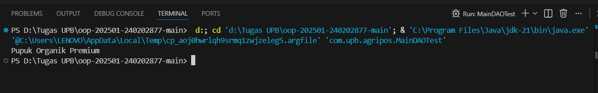

# Laporan Praktikum Minggu 11
Topik: Data Access Object (DAO) dan CRUD Database dengan JDBC
## Identitas
- Nama  : Nurlaela Kusumandari
- NIM   : 240202877
- Kelas : 3IKKA
---

## Tujuan
Setelah mengikuti praktikum ini, mahasiswa mampu:

- Menjelaskan konsep Data Access Object (DAO) dalam pengembangan aplikasi OOP.
- Menghubungkan aplikasi Java dengan basis data menggunakan JDBC.
- Mengimplementasikan operasi CRUD (Create, Read, Update, Delete) secara lengkap.
- Mengintegrasikan DAO dengan class aplikasi OOP sesuai prinsip desain yang baik.
---

## Dasar Teori
1. Konsep Data Access Object (DAO)
DAO adalah pola desain yang memisahkan logika akses data dari logika bisnis aplikasi. Dengan DAO, perubahan teknologi basis data tidak memengaruhi logika utama aplikasi.

Manfaat DAO:
- Kode lebih terstruktur dan mudah dipelihara
- Mengurangi tight coupling antara aplikasi dan database
- Mendukung pengujian dan pengembangan lanjutan
2. JDBC dan Koneksi Database
JDBC (Java Database Connectivity) digunakan untuk menghubungkan aplikasi Java dengan basis data relasional, dalam praktikum ini menggunakan PostgreSQL.
Komponen utama JDBC:
- DriverManager
- Connection
- PreparedStatement
- ResultSet

## Langkah Praktikum
1. Persiapan Database:
- Memastikan PostgreSQL berjalan di port 5432.
- Membuat database dengan nama agripos.
- Membuat tabel products dengan kolom: code (PK), name, price, dan stock.
2. Pembuatan Struktur Project (Package):
- Membuat package com.upb.agripos sebagai root.
- Membuat sub-package com.upb.agripos.dao untuk interface dan implementasi akses data.
- Membuat sub-package com.upb.agripos.model untuk representasi objek data.
3. Implementasi Kode (Coding):
- Membuat class model Product.java.
- Membuat interface ProductDAO.java untuk mendefinisikan operasi CRUD.
- Membuat class implementasi ProductDAOImpl.java yang berisi logika JDBC (koneksi dan query SQL).
- Membuat class main MainDAOTest.java untuk menguji koneksi dan fungsionalitas insert, update, select, dan delete.
4. Menjalankan Program (Run):
- Menjalankan file MainDAOTest.java dan memverifikasi output pada terminal.

---

## Kode Program
1. ProductDAOImpl.java (Implementasi Logika Database)
``` java
// ... imports
public class ProductDAOImpl implements ProductDAO {
    private final Connection connection;

    public ProductDAOImpl(Connection connection) {
        this.connection = connection;
    }

    @Override
    public void insert(Product p) throws Exception {
        String sql = "INSERT INTO products(code, name, price, stock) VALUES (?, ?, ?, ?)";
        try (PreparedStatement ps = connection.prepareStatement(sql)) {
            ps.setString(1, p.getCode());
            ps.setString(2, p.getName());
            ps.setDouble(3, p.getPrice());
            ps.setInt(4, p.getStock());
            ps.executeUpdate();
        }
    }
    // ... method CRUD lainnya (update, delete, findByCode, findAll)
}
```
2. MainDAOTest.java (Kode Pengujian Utama)
``` java
public class MainDAOTest {
    public static void main(String[] args) throws Exception {
        // Setup Koneksi ke Database PostgreSQL
        Connection conn = DriverManager.getConnection(
            "jdbc:postgresql://localhost:5432/agripos",
            "postgres",
            "1234"
        );

        ProductDAO dao = new ProductDAOImpl(conn);

        // 1. Insert Data Baru
        dao.insert(new Product("P01", "Pupuk Organik", 25000.0, 10));
        
        // 2. Update Data
        dao.update(new Product("P01", "Pupuk Organik Premium", 30000, 8));

        // 3. Read/Select Data dan Tampilkan Nama
        Product p = dao.findByCode("P01");
        System.out.println(p.getName()); // Output yang diharapkan: Pupuk Organik Premium

        // 4. Delete Data (cleanup)
        dao.delete("P01");
        
        conn.close();
    }
}
```

---

## Hasil Eksekusi
(Sertakan screenshot hasil eksekusi program.  

)
---

## Analisis
1. Cara Kerja Kode:
- Program dimulai dengan membuat koneksi ke database PostgreSQL (jdbc:postgresql://localhost:5432/agripos) menggunakan DriverManager.
- Objek ProductDAOImpl diinisialisasi dengan koneksi tersebut.
- Program melakukan operasi Insert produk "Pupuk Organik".
- Kemudian melakukan Update pada produk tersebut menjadi "Pupuk Organik Premium" dengan harga dan stok baru.
- Program memanggil method findByCode("P01") untuk mengambil data terbaru dari database dan mencetak namanya ke konsol (sesuai screenshot: "Pupuk Organik Premium").
- Terakhir, data dihapus menggunakan delete("P01") untuk membersihkan database setelah tes selesai, dan koneksi ditutup.
2. Perbedaan dengan Pendekatan Minggu Sebelumnya:
- Minggu ini kita menerapkan Persistence Layer menggunakan Database (PostgreSQL) dan JDBC, sedangkan minggu sebelumnya penyimpanan data hanya bersifat sementara di memori (menggunakan ArrayList atau Array).
- Penggunaan Design Pattern DAO (Data Access Object). Logika bisnis dipisahkan dari logika akses data SQL. Interface ProductDAO membuat kode lebih rapi dan loose coupling.
3. Kendala dan Solusi:
- Kendala: Awalnya mungkin terjadi error koneksi (SQLException) jika driver JDBC PostgreSQL belum ditambahkan ke library project atau kredensial (username/password) salah.
- Solusi: Memastikan file .jar driver PostgreSQL sudah ada di classpath dan string koneksi (URL, user, password) sesuai dengan konfigurasi database lokal.
---

## Kesimpulan
Praktikum minggu ini mengajarkan pentingnya integrasi aplikasi Java dengan database relasional menggunakan JDBC. Dengan menerapkan DAO Pattern, struktur kode menjadi lebih modular, di mana manipulasi data (SQL) terisolasi dalam class implementasi DAO. Hal ini memudahkan pemeliharaan kode (maintenance) dan pengembangan aplikasi skala besar yang membutuhkan penyimpanan data persisten.
---

## Quiz
(1. [Tuliskan kembali pertanyaan 1 dari panduan]  
   **Jawaban:** …  

2. [Tuliskan kembali pertanyaan 2 dari panduan]  
   **Jawaban:** …  

3. [Tuliskan kembali pertanyaan 3 dari panduan]  
   **Jawaban:** …  )
