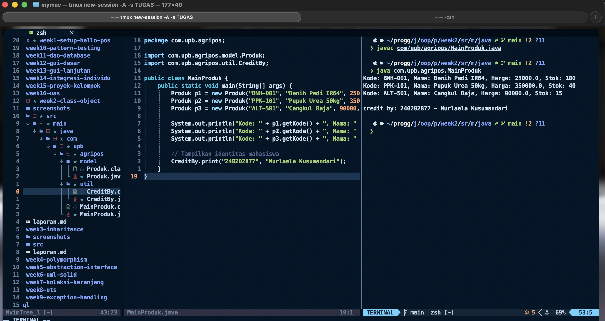

# Laporan Praktikum Minggu 1 (sesuaikan minggu ke berapa?)

Topik: ["Class dan Object"]

## Identitas

- Nama : Nurlaela Kusumandari
- NIM : 240202877
- Kelas : 3IKKA

---

## Tujuan

- Mahasiswa mampu **menjelaskan konsep class, object, atribut, dan method** dalam OOP.
- Mahasiswa mampu **menerapkan access modifier dan enkapsulasi** dalam pembuatan class.
- Mahasiswa mampu **mengimplementasikan class Produk pertanian** dengan atribut dan method yang sesuai.
- Mahasiswa mampu **mendemonstrasikan instansiasi object** serta menampilkan data produk pertanian di console.
- Mahasiswa mampu **menyusun laporan praktikum** dengan bukti kode, hasil eksekusi, dan analisis sederhana.

---

## Dasar Teori

Class adalah blueprint atau cetak biru dari sebuah objek. Objek merupakan instansiasi dari class yang berisi atribut (data) dan method (perilaku). Dalam OOP, enkapsulasi dilakukan dengan menyembunyikan data menggunakan access modifier (public, private, protected) serta menyediakan akses melalui getter dan setter.

Dalam konteks Agri-POS, produk pertanian seperti benih, pupuk, dan alat pertanian dapat direpresentasikan sebagai objek yang memiliki atribut nama, harga, dan stok. Dengan menggunakan class, setiap produk dapat dibuat, dikelola, dan dimanipulasi secara lebih terstruktur.

---

## Langkah Praktikum

1. **Membuat Class Produk**
   - Buat file `Produk.java` pada package `model`.
   - Tambahkan atribut: `kode`, `nama`, `harga`, dan `stok`.
   - Gunakan enkapsulasi dengan menjadikan atribut bersifat private dan membuat getter serta setter untuk masing-masing atribut.

2. **Membuat Class CreditBy**
   - Buat file `CreditBy.java` pada package `util`.
   - Isi class dengan method statis untuk menampilkan identitas mahasiswa di akhir output: `credit by: <NIM> - <Nama>`.

3. **Membuat Objek Produk dan Menampilkan Credit**
   - Buat file `MainProduk.java`.
   - Instansiasi minimal tiga objek produk, misalnya "Benih Padi", "Pupuk Urea", dan satu produk alat pertanian.
   - Tampilkan informasi produk melalui method getter.
   - Panggil `CreditBy.print("<NIM>", "<Nama>")` di akhir `main` untuk menampilkan identitas.

4. **Commit dan Push**
   - Commit dengan pesan: `week2-class-object`.

---

## Kode Program

### 1. Produk.java

```java
package com.upb.agripos.model;

public class Produk {
    private String kode;
    private String nama;
    private double harga;
    private int stok;

    public Produk(String kode, String nama, double harga, int stok) {
        this.kode = kode;
        this.nama = nama;
        this.harga = harga;
        this.stok = stok;
    }

    public String getKode() { return kode; }
    public void setKode(String kode) { this.kode = kode; }

    public String getNama() { return nama; }
    public void setNama(String nama) { this.nama = nama; }

    public double getHarga() { return harga; }
    public void setHarga(double harga) { this.harga = harga; }

    public int getStok() { return stok; }
    public void setStok(int stok) { this.stok = stok; }

    public void tambahStok(int jumlah) {
        this.stok += jumlah;
    }

    public void kurangiStok(int jumlah) {
        if (this.stok >= jumlah) {
            this.stok -= jumlah;
        } else {
            System.out.println("Stok tidak mencukupi!");
        }
    }
}
```

### 2. CreditBy.java

```java
package com.upb.agripos.util;

public class CreditBy {
    public static void print(String nim, String nama) {
        System.out.println("\ncredit by: " + nim + " - " + nama);
    }
}
```

### 3. MainProduk.java

```java
package com.upb.agripos;

import com.upb.agripos.model.Produk;
import com.upb.agripos.util.CreditBy;

public class MainProduk {
    public static void main(String[] args) {
        Produk p1 = new Produk("BNH-001", "Benih Padi IR64", 25000, 100);
        Produk p2 = new Produk("PPK-101", "Pupuk Urea 50kg", 350000, 40);
        Produk p3 = new Produk("ALT-501", "Cangkul Baja", 90000, 15);

        System.out.println("Kode: " + p1.getKode() + ", Nama: " + p1.getNama() + ", Harga: " + p1.getHarga() + ", Stok: " + p1.getStok());
        System.out.println("Kode: " + p2.getKode() + ", Nama: " + p2.getNama() + ", Harga: " + p2.getHarga() + ", Stok: " + p2.getStok());
        System.out.println("Kode: " + p3.getKode() + ", Nama: " + p3.getNama() + ", Harga: " + p3.getHarga() + ", Stok: " + p3.getStok());

        // Tampilkan identitas mahasiswa
        CreditBy.print("240202877", "Nurlaela Kusumandari");
    }
}
```

---

## Hasil Eksekusi

## 

## Analisis

- Jalannya kode: Program dijalankan melalui MainProduk yang mengimpor class Produk dan CreditBy, lalu menampilkan data produk serta identitas mahasiswa ke console.
- Perbedaan minggu ini: Pendekatan minggu ini menggunakan Object-Oriented Programming dengan class dan package, sedangkan minggu sebelumnya masih bersifat prosedural.
- Kendala dan solusi: Terjadi error package does not exist karena struktur folder tidak sesuai dengan deklarasi package, dan diatasi dengan menyesuaikan posisi file ke path com/upb/agripos/... sebelum dikompilasi.

---

## Kesimpulan

Dengan menggunakan class, package, dan metode tambahan, program menjadi modular, mudah dipelihara, serta menunjukkan penerapan dasar OOP yang benar.

---

## Quiz

1. [Apa fungsi class dalam OOP?]  
   **Jawaban:** Class berfungsi sebagai blueprint atau cetak biru untuk membuat object dengan atribut dan perilaku tertentu.

2. [Mengapa program perlu menggunakan package?]  
   **Jawaban:** Package digunakan untuk mengelompokkan class agar struktur kode lebih terorganisir dan mencegah konflik nama.

3. [Apa perbedaan method dan constructor?]  
   **Jawaban:** Constructor digunakan untuk inisialisasi object saat dibuat, sedangkan method digunakan untuk menjalankan fungsi atau perilaku object.
