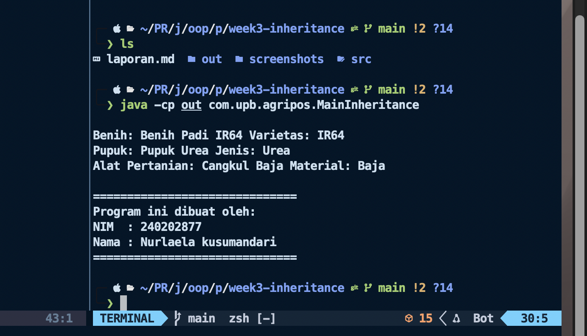

# Laporan Praktikum Minggu 3

Topik: Inheritance

## Identitas

- Nama : Nuelaela Kusumandari
- NIM : 240202877
- Kelas : 3IKKA

---

## Tujuan

- Mahasiswa mampu **menjelaskan konsep inheritance (pewarisan class)** dalam OOP.
- Mahasiswa mampu **membuat superclass dan subclass** untuk produk pertanian.
- Mahasiswa mampu **mendemonstrasikan hierarki class** melalui contoh kode.
- Mahasiswa mampu **menggunakan `super` untuk memanggil konstruktor dan method parent class**.
- Mahasiswa mampu **membuat laporan praktikum** yang menjelaskan perbedaan penggunaan inheritance dibanding class tunggal.

---

## Dasar Teori

- **Superclass**: class induk yang mendefinisikan atribut umum.
- **Subclass**: class turunan yang mewarisi atribut/method superclass, dan dapat menambahkan atribut/method baru.
- `super` digunakan untuk memanggil konstruktor atau method superclass.

---

## Langkah Praktikum

1. **Membuat Superclass Produk**
   - Gunakan class `Produk` dari Bab 2 sebagai superclass.

2. **Membuat Subclass**
   - `Benih.java` → atribut tambahan: varietas.
   - `Pupuk.java` → atribut tambahan: jenis pupuk (Urea, NPK, dll).
   - `AlatPertanian.java` → atribut tambahan: material (baja, kayu, plastik).

3. **Membuat Main Class**
   - Instansiasi minimal satu objek dari tiap subclass.
   - Tampilkan data produk dengan memanfaatkan inheritance.

4. **Menambahkan CreditBy**
   - Panggil class `CreditBy` untuk menampilkan identitas mahasiswa.

5. **Commit dan Push**
   - Commit dengan pesan: `week3-inheritance`.

---

## Kode Program

### Benih.java

```java
package com.upb.agripos.model;

public class Benih extends Produk {
    private String varietas;

    public Benih(String kode, String nama, double harga, int stok, String varietas) {
        super(kode, nama, harga, stok);
        this.varietas = varietas;
    }

    public String getVarietas() { return varietas; }
    public void setVarietas(String varietas) { this.varietas = varietas; }
}
```

### Pupuk.java

```java
package com.upb.agripos.model;

public class Pupuk extends Produk {
    private String jenis;

    public Pupuk(String kode, String nama, double harga, int stok, String jenis) {
        super(kode, nama, harga, stok);
        this.jenis = jenis;
    }

    public String getJenis() { return jenis; }
    public void setJenis(String jenis) { this.jenis = jenis; }
}
```

### AlatPertanian.java

```java
package com.upb.agripos.model;

public class AlatPertanian extends Produk {
    private String material;

    public AlatPertanian(String kode, String nama, double harga, int stok, String material) {
        super(kode, nama, harga, stok);
        this.material = material;
    }

    public String getMaterial() { return material; }
    public void setMaterial(String material) { this.material = material; }
}
```

### MainInheritance.java

```java
package com.upb.agripos;

import com.upb.agripos.model.*;
import com.upb.agripos.util.CreditBy;

public class MainInheritance {
    public static void main(String[] args) {
        Benih b = new Benih("BNH-001", "Benih Padi IR64", 25000, 100, "IR64");
        Pupuk p = new Pupuk("PPK-101", "Pupuk Urea", 350000, 40, "Urea");
        AlatPertanian a = new AlatPertanian("ALT-501", "Cangkul Baja", 90000, 15, "Baja");

        System.out.println("Benih: " + b.getNama() + " Varietas: " + b.getVarietas());
        System.out.println("Pupuk: " + p.getNama() + " Jenis: " + p.getJenis());
        System.out.println("Alat Pertanian: " + a.getNama() + " Material: " + a.getMaterial());

        CreditBy.print("240202877", "Nurlaela Kusumandari");
    }
}
```

### CreditBy.java

```java
package com.upb.agripos.util;

public class CreditBy {
    public static void print(String nim, String nama) {
        System.out.println("\n==============================");
        System.out.println("Program ini dibuat oleh:");
        System.out.println("NIM  : " + nim);
        System.out.println("Nama : " + nama);
        System.out.println("==============================");
    }
}

```

### Produk.java

```java
package com.upb.agripos.model;

public class Produk {
    private String kode;
    private String nama;
    private double harga;
    private int stok;

    public Produk(String kode, String nama, double harga, int stok) {
        this.kode = kode;
        this.nama = nama;
        this.harga = harga;
        this.stok = stok;
    }

    public String getKode() { return kode; }
    public void setKode(String kode) { this.kode = kode; }

    public String getNama() { return nama; }
    public void setNama(String nama) { this.nama = nama; }

    public double getHarga() { return harga; }
    public void setHarga(double harga) { this.harga = harga; }

    public int getStok() { return stok; }
    public void setStok(int stok) { this.stok = stok; }

    @Override
    public String toString() {
        return "Kode: " + kode + ", Nama: " + nama + ", Harga: " + harga + ", Stok: " + stok;
    }
}
```

---

## Hasil Eksekusi



---

## Analisis

- Program dimulai dari kelas MainInheritance.
Di dalam main(), dibuat tiga objek dari kelas turunan (Benih, Pupuk, dan AlatPertanian).
Setiap kelas turunan mewarisi atribut dan metode dari kelas induk Produk, seperti kode, nama, harga, dan stok, lalu menambahkan atribut khusus:
  - Benih → varietas
  - Pupuk → jenis
  - AlatPertanian → material
    Saat program dijalankan:
  1.  Konstruktor subclass memanggil konstruktor superclass (super(...)) untuk mengisi data umum produk.
  2.  Program menampilkan data tiap objek melalui System.out.println().
  3.  Terakhir, kelas CreditBy digunakan untuk mencetak identitas pembuat program.
      Dengan demikian, program menunjukkan bagaimana pewarisan (inheritance) bekerja untuk mengelompokkan produk pertanian berdasarkan kesamaan atribut dasar.

- Pada minggu sebelumnya (tanpa inheritance), setiap kelas mungkin memiliki atribut dan metode yang berulang seperti nama, harga, dan stok.
Minggu ini, dengan menggunakan inheritance, atribut dan metode umum dipindahkan ke satu kelas induk (Produk), lalu kelas turunan cukup menambahkan atribut spesifik saja.
  Perbedaan utamanya:
  - Minggu lalu: Setiap kelas berdiri sendiri → duplikasi kode tinggi.
  - Minggu ini: Menggunakan pewarisan → kode lebih efisien, terstruktur, dan mudah dikembangkan.

- Beberapa kendala yang mungkin muncul:
  1. Error package not found — karena struktur folder tidak sesuai dengan deklarasi package.

     🔧 Solusi: Pastikan folder com/upb/agripos/... sesuai dengan nama package di dalam file .java.
  2. Class not found saat dijalankan — karena hasil compile tidak dimasukkan ke classpath.

     🔧 Solusi: Jalankan dengan perintah java -cp out com.upb.agripos.MainInheritance.
  3. Typo pada nama file atau class — Java sensitif terhadap huruf besar kecil.

     🔧 Solusi: Pastikan nama file sama persis dengan nama class publik di dalamnya.

---

## Kesimpulan

## Dengan menggunakan class dan inheritance, program menjadi lebih terstruktur, efisien, dan mudah dikelola.
Konsep pewarisan memungkinkan kita untuk membuat kelas dasar yang menyimpan atribut umum, sehingga kode dapat digunakan kembali (reusability) dan lebih mudah dikembangkan tanpa perlu menulis ulang.

## Quiz

1. Apa keuntungan menggunakan inheritance dibanding membuat class terpisah tanpa hubungan?
   **Jawaban:** Inheritance mengurangi duplikasi kode, mempermudah pemeliharaan, dan memungkinkan penggunaan kembali atribut serta metode umum dari superclass.

2. Bagaimana cara subclass memanggil konstruktor superclass?
   **Jawaban:** Dengan menggunakan kata kunci super(...) di baris pertama konstruktor subclass.
   Contoh:

   ```java
   public Benih(String kode, String nama, double harga, int stok, String varietas) {
    super(kode, nama, harga, stok);
    this.varietas = varietas;
    }
   ```

3. Berikan contoh kasus di POS pertanian selain Benih, Pupuk, dan Alat Pertanian yang bisa dijadikan subclass.
   **Jawaban:**
   - Pestisida (dengan atribut tambahan seperti bahanAktif)
   - ObatTanaman (atribut fungsi, misalnya “anti jamur”)
   - BibitTanaman (atribut jenisTanaman, seperti “Cabai” atau “Tomat”)
