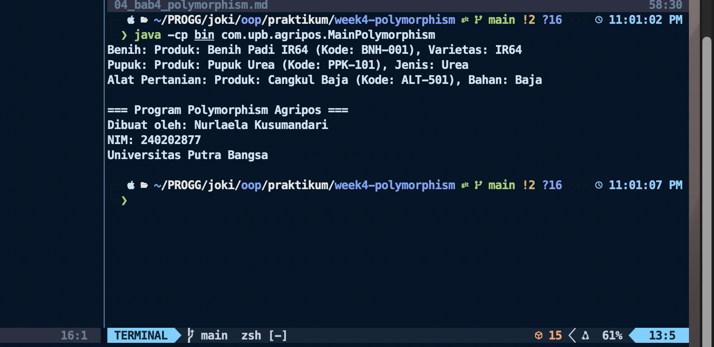

# Laporan Praktikum Minggu 4

Topik: Polymorphism

## Identitas

- Nama : Nurlaela Kusumandari
- NIM : 240202877
- Kelas : 3IKKA

---

## Tujuan

- Mahasiswa mampu **menjelaskan konsep polymorphism** dalam OOP.
- Mahasiswa mampu **membedakan method overloading dan overriding**.
- Mahasiswa mampu **mengimplementasikan polymorphism (overriding, overloading, dynamic binding)** dalam program.
- Mahasiswa mampu **menganalisis contoh kasus polymorphism** pada sistem nyata (Agri-POS).

---

## Dasar Teori

Polymorphism berarti “banyak bentuk” dan memungkinkan objek yang berbeda merespons panggilan method yang sama dengan cara yang berbeda.

1. **Overloading** → mendefinisikan method dengan nama sama tetapi parameter berbeda.
2. **Overriding** → subclass mengganti implementasi method dari superclass.
3. **Dynamic Binding** → pemanggilan method ditentukan saat runtime, bukan compile time.

Dalam konteks Agri-POS, misalnya:

- Method `getInfo()` pada `Produk` dioverride oleh `Benih`, `Pupuk`, `AlatPertanian` untuk menampilkan detail spesifik.
- Method `tambahStok()` bisa dibuat overload dengan parameter berbeda (int, double).

---

## Langkah Praktikum

1. **Overloading**
   - Tambahkan method `tambahStok(int jumlah)` dan `tambahStok(double jumlah)` pada class `Produk`.

2. **Overriding**
   - Tambahkan method `getInfo()` pada superclass `Produk`.
   - Override method `getInfo()` pada subclass `Benih`, `Pupuk`, dan `AlatPertanian`.

3. **Dynamic Binding**
   - Buat array `Produk[] daftarProduk` yang berisi objek `Benih`, `Pupuk`, dan `AlatPertanian`.
   - Loop array tersebut dan panggil `getInfo()`. Perhatikan bagaimana Java memanggil method sesuai jenis objek aktual.

4. **Main Class**
   - Buat `MainPolymorphism.java` untuk mendemonstrasikan overloading, overriding, dan dynamic binding.

5. **CreditBy**
   - Tetap panggil `CreditBy.print("240202877", "Nurlaela Kusumandari")`.

6. **Commit dan Push**
   - Commit dengan pesan: `week4-polymorphism`.

---

## Kode Program

### Produk.java (Overloading & getInfo default)

```java
package com.upb.agripos.model;

public class Produk {
    private String kode;
    private String nama;
    private double harga;
    private int stok;

    public Produk(String kode, String nama, double harga, int stok) {
        this.kode = kode;
        this.nama = nama;
        this.harga = harga;
        this.stok = stok;
    }

    public void tambahStok(int jumlah) {
        this.stok += jumlah;
    }

    public void tambahStok(double jumlah) {
        this.stok += (int) jumlah;
    }

    public String getInfo() {
        return "Produk: " + nama + " (Kode: " + kode + ")";
    }
}
```

### Benih.java (Overriding)

```java
package com.upb.agripos.model;

public class Benih extends Produk {
    private String varietas;

    public Benih(String kode, String nama, double harga, int stok, String varietas) {
        super(kode, nama, harga, stok);
        this.varietas = varietas;
    }

    @Override
    public String getInfo() {
        return "Benih: " + super.getInfo() + ", Varietas: " + varietas;
    }
}
```

### MainPolymorphism.java

```java
package com.upb.agripos;

import com.upb.agripos.model.*;
import com.upb.agripos.util.CreditBy;

public class MainPolymorphism {
    public static void main(String[] args) {
        Produk[] daftarProduk = {
            new Benih("BNH-001", "Benih Padi IR64", 25000, 100, "IR64"),
            new Pupuk("PPK-101", "Pupuk Urea", 350000, 40, "Urea"),
            new AlatPertanian("ALT-501", "Cangkul Baja", 90000, 15, "Baja")
        };

        for (Produk p : daftarProduk) {
            System.out.println(p.getInfo()); // Dynamic Binding
        }

        CreditBy.print("<NIM>", "<Nama Mahasiswa>");
    }
}
```

### CreditBy.java (unnuk menampilkan identitas pembuat)

```java
package com.upb.agripos.util;

public class CreditBy {
    public static void print(String nim, String nama) {
        System.out.println("\n=== Program Polymorphism Agripos ===");
        System.out.println("Dibuat oleh: " + nama);
        System.out.println("NIM: " + nim);
        System.out.println("Universitas Putra Bangsa");
    }
}

```

### AlatPertanian.java

```java
package com.upb.agripos.model;

public class AlatPertanian extends Produk {
    private String bahan;

    public AlatPertanian(String kode, String nama, double harga, int stok, String bahan) {
        super(kode, nama, harga, stok);
        this.bahan = bahan;
    }

    @Override
    public String getInfo() {
        return "Alat Pertanian: " + super.getInfo() + ", Bahan: " + bahan;
    }
}

```

### Pupuk.java

```java
package com.upb.agripos.model;

public class Pupuk extends Produk {
    private String jenis;

    public Pupuk(String kode, String nama, double harga, int stok, String jenis) {
        super(kode, nama, harga, stok);
        this.jenis = jenis;
    }

    @Override
    public String getInfo() {
        return "Pupuk: " + super.getInfo() + ", Jenis: " + jenis;
    }
}

```

## Hasil Eksekusi



---

## Analisis

- Program dimulai dari MainPolymorphism.java, di mana dibuat sebuah array Produk[] daftarProduk yang berisi tiga objek berbeda: Benih, Pupuk, dan AlatPertanian.
  Meskipun ketiganya memiliki tipe dasar Produk, masing-masing memiliki implementasi sendiri dari method getInfo() (hasil dari method overriding).
  Ketika dilakukan perulangan:

```java
for (Produk p : daftarProduk) {
    System.out.println(p.getInfo());
}
```

Java akan memanggil getInfo() milik kelas sebenarnya dari objek tersebut (misalnya milik Benih, bukan milik Produk), karena Java menggunakan dynamic binding pada runtime.
Hasilnya, setiap objek menampilkan informasi sesuai jenis produknya.
Terakhir, CreditBy.print() dipanggil untuk menampilkan informasi pembuat program.

- - Minggu sebelumnya (Week 3 – Inheritance):
    Fokus pada pewarisan class (inheritance), di mana subclass mewarisi atribut dan method dari superclass, serta mungkin menambahkan atribut baru.
    Tidak semua method diubah — hanya menggunakan inheritance dasar.
  - Minggu ini (Week 4 – Polymorphism):
    Fokus pada polymorphism dan method overriding, di mana subclass dapat mengubah perilaku method yang diwarisi dari superclass.
    Dengan polymorphism, satu variabel bertipe Produk bisa mereferensikan berbagai jenis objek (Benih, Pupuk, AlatPertanian) dan menampilkan perilaku berbeda tergantung objek aslinya.
- Kendala umum:
  - Error package does not exist saat kompilasi karena struktur folder dan package tidak sesuai.
  - Method getInfo() tidak di-override dengan benar karena penulisan tanda @Override salah atau parameter tidak sesuai.
  - Kesalahan path class saat menjalankan java -cp bin com.upb.agripos.MainPolymorphism.
    Cara mengatasinya:
  - Pastikan struktur folder sesuai dengan package (src/main/java/com/upb/agripos/...).
  - Gunakan @Override untuk memastikan method benar-benar menimpa method superclass.
  - Kompilasi dengan flag -d bin agar file .class tersimpan sesuai struktur package.
  - Jalankan menggunakan nama penuh package, bukan nama file saja.

---

## Kesimpulan

Dengan menerapkan polymorphism melalui method overriding, program menjadi lebih fleksibel dan mudah dikembangkan.
Setiap subclass (Benih, Pupuk, AlatPertanian) dapat memiliki perilaku unik meskipun dipanggil melalui referensi yang sama (Produk).
Hal ini memperlihatkan kekuatan Object-Oriented Programming dalam mengelola banyak jenis objek secara dinamis dan efisien.---

## Quiz

(1. [Tuliskan kembali pertanyaan 1 dari panduan]  
 **Jawaban:**

- Overloading adalah mendefinisikan beberapa method dengan nama sama tapi parameter berbeda dalam satu class.
- Overriding adalah mendefinisikan ulang method dari superclass di subclass dengan nama dan parameter yang sama untuk mengubah perilakunya.

2. [Tuliskan kembali pertanyaan 2 dari panduan]  
   **Jawaban:**
   Java menentukan method berdasarkan tipe objek sebenarnya (runtime type), bukan berdasarkan tipe referensinya.
   Artinya, jika variabel bertipe Produk tetapi objeknya new Pupuk(), maka method getInfo() milik Pupuk yang dipanggil.

3. [Tuliskan kembali pertanyaan 3 dari panduan]  
   **Jawaban:**
   Dalam sistem POS toko elektronik:
   - Superclass: Barang
   - Subclass: Laptop, Smartphone, Aksesoris
   - Masing-masing memiliki method getInfo() yang menampilkan detail berbeda, tapi semuanya bisa disimpan dalam array Barang[] daftarBarang dan diproses secara polimorfik.
