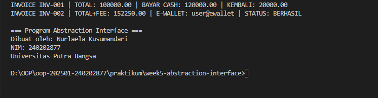

# Laporan Praktikum Minggu 5

Topik: Abstraction Interface

## Identitas

- Nama : Nurlaela Kusumandari
- NIM : 240202877
- Kelas : 3IKKA

---

## Tujuan

- Mahasiswa mampu **menjelaskan perbedaan abstract class dan interface**.
- Mahasiswa mampu **mendesain abstract class dengan method abstrak** sesuai kebutuhan kasus.
- Mahasiswa mampu **membuat interface dan mengimplementasikannya pada class**.
- Mahasiswa mampu **menerapkan multiple inheritance melalui interface** pada rancangan kelas.
- Mahasiswa mampu **mendokumentasikan kode** (komentar kelas/method, README singkat pada folder minggu).

---

## Dasar Teori

**Abstraksi** adalah proses menyederhanakan kompleksitas dengan menampilkan elemen penting dan menyembunyikan detail implementasi.

- **Abstract class**: tidak dapat diinstansiasi, dapat memiliki method abstrak (tanpa badan) dan non-abstrak. Dapat menyimpan state (field).
- **Interface**: kumpulan kontrak (method tanpa implementasi konkret). Sejak Java 8 mendukung default method. Mendukung **multiple inheritance** (class dapat mengimplementasikan banyak interface).
- Gunakan **abstract class** bila ada _shared state_ dan perilaku dasar; gunakan **interface** untuk mendefinisikan kemampuan/kontrak lintas hierarki.

Dalam konteks Agri-POS, **Pembayaran** dapat dimodelkan sebagai abstract class dengan method abstrak `prosesPembayaran()` dan `biaya()`. Implementasi konkritnya: `Cash` dan `EWallet`. Kemudian, interface seperti `Validatable` (mis. verifikasi OTP) dan `Receiptable` (mencetak bukti) dapat diimplementasikan oleh jenis pembayaran yang relevan.

---

## Langkah Praktikum

1. **Abstract Class – Pembayaran**

   - Buat `Pembayaran` (abstract) dengan field `invoiceNo`, `total` dan method:
     - `double biaya()` (abstrak) → biaya tambahan (fee).
     - `boolean prosesPembayaran()` (abstrak) → mengembalikan status berhasil/gagal.
     - `double totalBayar()` (konkrit) → `return total + biaya();`.

2. **Subclass Konkret**

   - `Cash` → biaya = 0, proses = selalu berhasil jika `tunai >= totalBayar()`.
   - `EWallet` → biaya = 1.5% dari `total`; proses = membutuhkan validasi.

3. **Interface**

   - `Validatable` → `boolean validasi();` (contoh: OTP).
   - `Receiptable` → `String cetakStruk();`

4. **Multiple Inheritance via Interface**

   - `EWallet` mengimplementasikan **dua interface**: `Validatable`, `Receiptable`.
   - `Cash` setidaknya mengimplementasikan `Receiptable`.

5. **Main Class**

   - Buat `MainAbstraction.java` untuk mendemonstrasikan pemakaian `Pembayaran` (polimorfik).
   - Tampilkan hasil proses dan struk. Di akhir, panggil `CreditBy.print("[NIM]", "[Nama]")`.

6. **Commit dan Push**
   - Commit dengan pesan: `week5-abstraction-interface`.

---

## Kode Program

### Pembayaran.java (abstract)

```java
package com.upb.agripos.model.pembayaran;

public abstract class Pembayaran {
   protected String invoiceNo;
   protected double total;

   public Pembayaran(String invoiceNo, double total) {
      this.invoiceNo = invoiceNo;
      this.total = total;
   }

   public abstract double biaya();               // fee/biaya tambahan
   public abstract boolean prosesPembayaran();   // proses spesifik tiap metode

   public double totalBayar() {
      return total + biaya();
   }

   public String getInvoiceNo() { return invoiceNo; }
   public double getTotal() { return total; }
}
```

### Interface: Validatable & Receiptable

```java
package com.upb.agripos.model.kontrak;

public interface Validatable {
   boolean validasi(); // misal validasi OTP/ PIN
}
```

```java
package com.upb.agripos.model.kontrak;

public interface Receiptable {
   String cetakStruk();
}
```

### Cash.java (extends Pembayaran, implements Receiptable)

```java
package com.upb.agripos.model.pembayaran;

import com.upb.agripos.model.kontrak.Receiptable;

public class Cash extends Pembayaran implements Receiptable {
   private double tunai;

   public Cash(String invoiceNo, double total, double tunai) {
      super(invoiceNo, total);
      this.tunai = tunai;
   }

   @Override
   public double biaya() {
      return 0.0;
   }

   @Override
   public boolean prosesPembayaran() {
      return tunai >= totalBayar(); // sederhana: cukup uang tunai
   }

   @Override
   public String cetakStruk() {
      return String.format("INVOICE %s | TOTAL: %.2f | BAYAR CASH: %.2f | KEMBALI: %.2f",
               invoiceNo, totalBayar(), tunai, Math.max(0, tunai - totalBayar()));
   }
}
```

### EWallet.java (extends Pembayaran, implements Validatable & Receiptable)

```java
package com.upb.agripos.model.pembayaran;

import com.upb.agripos.model.kontrak.Validatable;
import com.upb.agripos.model.kontrak.Receiptable;

public class EWallet extends Pembayaran implements Validatable, Receiptable {
   private String akun;
   private String otp; // sederhana untuk simulasi

   public EWallet(String invoiceNo, double total, String akun, String otp) {
      super(invoiceNo, total);
      this.akun = akun;
      this.otp = otp;
   }

   @Override
   public double biaya() {
      return total * 0.015; // 1.5% fee
   }

   @Override
   public boolean validasi() {
      return otp != null && otp.length() == 6; // contoh validasi sederhana
   }

   @Override
   public boolean prosesPembayaran() {
      return validasi(); // jika validasi lolos, anggap berhasil
   }

   @Override
   public String cetakStruk() {
      return String.format("INVOICE %s | TOTAL+FEE: %.2f | E-WALLET: %s | STATUS: %s",
               invoiceNo, totalBayar(), akun, prosesPembayaran() ? "BERHASIL" : "GAGAL");
   }
}
```

### MainAbstraction.java

```java
package com.upb.agripos;

import com.upb.agripos.model.pembayaran.*;
import com.upb.agripos.model.kontrak.*;
import com.upb.agripos.util.CreditBy;

public class MainAbstraction {
   public static void main(String[] args) {
      Pembayaran cash = new Cash("INV-001", 100000, 120000);
      Pembayaran ew = new EWallet("INV-002", 150000, "user@ewallet", "123456");

      System.out.println(((Receiptable) cash).cetakStruk());
      System.out.println(((Receiptable) ew).cetakStruk());

      CreditBy.print("240202877", "Nurlaela Kusumandari");
   }
}
```

---

## Hasil Eksekusi



---

## Analisis

- Program dimulai dari **MainAbstraction.java**. Pada bagian ini dibuat dua objek pembayaran:

  - `Cash` -> pembayaran tunai tanpa biaya tambahan.
  - `EWallet` -> pembayaran digital dengan fee 1.5% dan membutuhkan validasi OTP.

  Kedua objek tersebut disimpan dalam variabel bertipe **Pembayaran**, sehingga menunjukkan penggunaan **abstraksi + polymorphism**.
  Karena `Pembayaran` adalah abstract class, ia tidak bisa diinstansiasi, tetapi dapat menjadi tipe referensi bagi subclass.

  Setelah itu, masing-masing objek di-cast ke interface **Receiptable**, lalu dipanggil `cetakStruk()`.
  Meskipun keduanya menggunakan method dengan nama sama, output berbeda sesuai implementasi masing-masing class.

  Pada `EWallet`, sebelum pembayaran dianggap berhasil, dilakukan proses validasi OTP melalui interface **Validatable**.
  Ini menunjukkan bagaimana **multiple inheritance via interface** bekerja di Java.

  Terakhir, program menampilkan identitas menggunakan `CreditBy.print()`.

- **Perbedaan dengan minggu sebelumnya (Polymorphism):**

  - Minggu 4 fokus pada **overloading, overriding, serta runtime polymorphism** menggunakan pewarisan class produk.
  - Minggu 5 fokus pada **abstraksi**, yaitu menyembunyikan detail implementasi dan memaksa subclass untuk menyediakan perilaku tertentu.
  - Hadir konsep baru yaitu **interface**, yang tidak tersedia pada praktikum minggu sebelumnya.
  - Minggu ini memperkenalkan **multiple inheritance**, yang tidak bisa dilakukan dengan class tetapi bisa dilakukan dengan interface.
  - Hierarki objek lebih kompleks karena class dapat memiliki base class sekaligus beberapa interface.

- **Kendala umum yang mungkin terjadi:**

  - **Error saat cast interface** karena objek tidak mengimplementasikan interface yang dicast.

    Solusi: pastikan class benar-benar implements interface tersebut.

  - **Kesalahan struktur package**, sehingga class tidak ditemukan saat kompilasi.

    Solusi: pastikan folder mengikuti struktur `com/upb/agripos/model/...`.

  - **Method abstract tidak dioverride pada subclass**, menyebabkan error `Class is not abstract`.

    Solusi: cek ulang nama method dan visibilitas, gunakan @Override.

---

## Kesimpulan

Pada praktikum minggu ke-5, mahasiswa mempelajari konsep **abstraksi** melalui penggunaan **abstract class** dan **interface**. Dengan abstraksi, detail implementasi disembunyikan sehingga kode menjadi lebih fleksibel, mudah diperluas, dan mengikuti prinsip clean architecture.
Abstract class digunakan untuk menentukan struktur dasar yang memiliki state dan perilaku umum, sedangkan interface dipakai untuk mendefinisikan kemampuan tambahan serta memungkinkan multiple inheritance.
Melalui implementasi pada sistem pembayaran Agri-POS, terlihat bagaimana abstraksi membuat rancangan kode lebih modular, mudah diubah, dan tetap konsisten antar kelas.

---

## Quiz

1. Jelaskan perbedaan konsep dan penggunaan abstract class dan interface.

   **Jawaban:**

   - **Abstract class** digunakan ketika beberapa class berbagi atribut dan perilaku yang sama. Dapat memiliki field, method konkret, dan method abstrak.
   - **Interface** digunakan untuk mendefinisikan kontrak kemampuan tertentu, tanpa state, dan dapat diimplementasikan oleh banyak class dari hierarki berbeda.
   - Abstract class cocok sebagai dasar hierarki, sedangkan interface cocok sebagai tambahan kemampuan lintas kelas.

2. Mengapa multiple inheritance lebih aman dilakukan dengan interface pada Java?

   **Jawaban:**

   Karena interface hanya berisi kontrak (tanpa state), sehingga tidak terjadi konflik pewarisan field atau implementasi method. Multiple inheritance antar class dapat menyebabkan **diamond problem** (dua superclass memberikan implementasi berbeda), tetapi interface tidak menimbulkan konflik karena class wajib menyediakan implementasi sendiri jika ada benturan.

3. Pada contoh Agri-POS, bagian mana yang paling tepat menjadi abstract class dan mana yang menjadi interface Jelaskan alasannya.

   **Jawaban:**

   - **Pembayaran** tepat menjadi **abstract class** karena memiliki state (`invoiceNo`, `total`) dan perilaku dasar (`totalBayar()`), serta menyediakan kerangka umum untuk semua jenis pembayaran.
   - **Validatable** dan **Receiptable** tepat menjadi **interface** karena keduanya adalah kemampuan tambahan yang tidak semua pembayaran pasti punya. **Validatable**, hanya digunakan EWallet untuk verifikasi. **Receiptable**, kemampuan mencetak struk yang dapat dimiliki berbagai jenis pembayaran. Dengan pemisahan ini, desain menjadi lebih fleksibel dan tidak memaksakan class untuk memiliki fitur yang sebenarnya tidak diperlukan.
