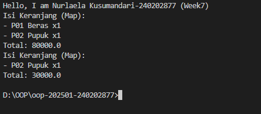

# Laporan Praktikum Minggu 7
Topik: Collections dan Implementasi Keranjang Belanja

## Identitas
- Nama  : Nurlaela Kusumandari
- NIM   : 240202877
- Kelas : 3IKKA

---

## Tujuan
Mahasiswa mampu:
1. Menjelaskan konsep collection dalam Java (List, Map, Set).
2. Menggunakan ArrayList untuk menyimpan dan mengelola objek.
3. Mengimplementasikan Map atau Set sesuai kebutuhan pengelolaan data.
4. Melakukan operasi dasar pada collection: tambah, hapus, dan hitung total.
5. Menganalisis efisiensi penggunaan collection dalam konteks sistem Agri-POS.

---

## Dasar Teori
### 1. Collections Framework
Java Collections Framework menyediakan struktur data untuk mengelola objek secara dinamis dan efisien.

Struktur utama:
- List (implementasi: ArrayList) — Terurut, dapat menyimpan elemen duplikat.
- Map (implementasi: HashMap) — Menyimpan pasangan key–value, akses cepat berdasarkan key.
- Set (implementasi: HashSet) — Tidak menerima duplikat dan tidak mempertahankan urutan.

---

### 2. Studi Kasus: Keranjang Belanja Agri-POS

Keranjang belanja harus dapat:

- Menambahkan produk
- Menghapus produk
- Menampilkan isi keranjang
- Menghitung total nilai transaksi
- Menangani jumlah (quantity) menggunakan Map

Kasus ini mencerminkan penggunaan struktur data dalam aplikasi nyata seperti POS.

---

## Langkah Praktikum
### 1. Membuat Class Product

```java
package com.upb.agripos;

public class Product {
   private final String code;
   private final String name;
   private final double price;

   public Product(String code, String name, double price) {
      this.code = code;
      this.name = name;
      this.price = price;
   }

   public String getCode() { return code; }
   public String getName() { return name; }
   public double getPrice() { return price; }
}
```

## 2. Implementasi Keranjang dengan ArrayList

```java
package com.upb.agripos;

import java.util.ArrayList;

public class ShoppingCart {
   private final ArrayList<Product> items = new ArrayList<>();

   public void addProduct(Product p) { items.add(p); }
   public void removeProduct(Product p) { items.remove(p); }

   public double getTotal() {
      double sum = 0;
      for (Product p : items) {
         sum += p.getPrice();
      }
      return sum;
   }

   public void printCart() {
      System.out.println("Isi Keranjang:");
      for (Product p : items) {
         System.out.println("- " + p.getCode() + " " + p.getName() + " = " + p.getPrice());
      }
      System.out.println("Total: " + getTotal());
   }
}
```

## 3. Main Program

```java
package com.upb.agripos;

public class MainCart {
   public static void main(String[] args) {
      System.out.println("Hello, I am Nurlaela Kusumandari-240202877 (Week7)");

      Product p1 = new Product("P01", "Beras", 50000);
      Product p2 = new Product("P02", "Pupuk", 30000);

      ShoppingCart cart = new ShoppingCart();
      cart.addProduct(p1);
      cart.addProduct(p2);
      cart.printCart();

      cart.removeProduct(p1);
      cart.printCart();
   }
}
```

## 4. Implementasi Alternatif Menggunakan Map (Dengan Quantity)

```java
package com.upb.agripos;

import java.util.HashMap;
import java.util.Map;

public class ShoppingCartMap {
   private final Map<Product, Integer> items = new HashMap<>();

   public void addProduct(Product p) { items.put(p, items.getOrDefault(p, 0) + 1); }

   public void removeProduct(Product p) {
      if (!items.containsKey(p)) return;
      int qty = items.get(p);
      if (qty > 1) items.put(p, qty - 1);
      else items.remove(p);
   }

   public double getTotal() {
      double total = 0;
      for (Map.Entry<Product, Integer> entry : items.entrySet()) {
         total += entry.getKey().getPrice() * entry.getValue();
      }
      return total;
   }

   public void printCart() {
      System.out.println("Isi Keranjang (Map):");
      for (Map.Entry<Product, Integer> e : items.entrySet()) {
         System.out.println("- " + e.getKey().getCode() + " " + e.getKey().getName() + " x" + e.getValue());
      }
      System.out.println("Total: " + getTotal());
   }
}
```

---

## Hasil Eksekusi
Hasil eksekusi program menunjukkan bahwa sistem keranjang belanja berjalan sesuai dengan rancangan.

- **Implementasi ArrayList**  
  Program berhasil menampilkan isi keranjang setelah penambahan produk, menampilkan total harga, kemudian memperbarui isi keranjang dan total setelah salah satu produk dihapus.

  

- **Implementasi Map (dengan quantity)**  
  Program berhasil mencatat jumlah (quantity) setiap produk, menampilkan produk beserta jumlahnya, serta menghitung total harga berdasarkan kuantitas. Penghapusan produk juga menyesuaikan quantity atau menghapus data jika jumlah menjadi nol.

  

---

## Analisis
1. **Cara kerja kode**  
   - Class `Product` merepresentasikan data produk dengan atribut kode, nama, dan harga.  
   - Pada `ShoppingCart` (ArrayList), setiap produk disimpan sebagai elemen terpisah di dalam list. Total harga dihitung dengan menjumlahkan harga seluruh objek `Product`.  
   - Pada `ShoppingCartMap`, struktur `Map<Product, Integer>` digunakan untuk menyimpan produk beserta jumlahnya (quantity). Total harga dihitung dengan mengalikan harga produk dengan jumlahnya.  

2. **Perbedaan pendekatan dengan minggu sebelumnya**  
   - Minggu sebelumnya lebih fokus pada **desain arsitektur sistem dan UML serta prinsip SOLID**.  
   - Minggu ini fokus pada **implementasi konkret collection Java**, khususnya bagaimana data produk dikelola di dalam keranjang belanja menggunakan `List` dan `Map`.

3. **Kendala dan cara mengatasinya**  
   - Kendala utama adalah menentukan struktur data yang tepat untuk menyimpan produk dengan quantity.  
   - Masalah ini diatasi dengan menggunakan `Map<Product, Integer>` sehingga jumlah produk dapat dikelola dengan lebih efisien dibanding hanya menggunakan `List`.

---

## Kesimpulan
Praktikum minggu ini menunjukkan bahwa penggunaan **Java Collections Framework** sangat membantu dalam pengelolaan data keranjang belanja.  
Pendekatan menggunakan `ArrayList` cocok untuk keranjang sederhana, sedangkan `Map` lebih efektif ketika diperlukan pengelolaan jumlah (quantity) produk. Dengan pemilihan collection yang tepat, sistem menjadi lebih efisien, mudah dikembangkan, dan sesuai dengan kebutuhan bisnis Agri-POS.

---

## Quiz
1. **Jelaskan perbedaan mendasar antara List, Map, dan Set.**  
   **Jawaban:**  
   List menyimpan data secara terurut dan memperbolehkan duplikasi elemen.  
   Map menyimpan data dalam bentuk pasangan key–value dan tidak memperbolehkan key yang sama.  
   Set menyimpan data unik tanpa duplikasi dan umumnya tidak menjamin urutan elemen.

2. **Mengapa ArrayList cocok digunakan untuk keranjang belanja sederhana?**  
   **Jawaban:**  
   Karena ArrayList mudah digunakan, mendukung penambahan dan penghapusan data secara dinamis, serta cocok untuk menyimpan daftar produk tanpa kebutuhan pengelolaan quantity yang kompleks.

3. **Bagaimana struktur Set mencegah duplikasi data?**  
   **Jawaban:**  
   Set menggunakan mekanisme perbandingan (`equals` dan `hashCode`) sehingga elemen yang sama tidak dapat disimpan lebih dari satu kali.

4. **Kapan sebaiknya menggunakan Map dibandingkan List? Jelaskan dengan contoh.**  
   **Jawaban:**  
   Map sebaiknya digunakan ketika data memiliki pasangan kunci dan nilai, misalnya produk sebagai key dan jumlah sebagai value pada keranjang belanja. Dengan Map, quantity produk dapat dikelola dengan lebih efisien dibanding List.
