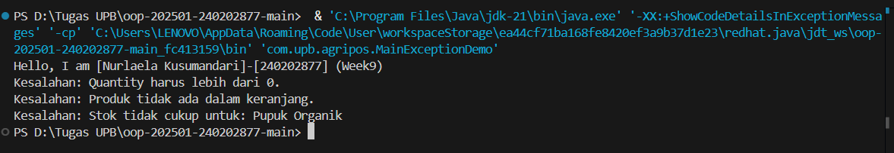

# Laporan Praktikum Minggu 9
Topik: Exception Handling, Custom Exception, dan Penerapan Design Pattern

## Identitas
- Nama  : Nurlaela Kusumandari
- NIM   : 240202877
- Kelas : 3IKKA
---

## Tujuan
Mahasiswa mampu:

1. Menjelaskan perbedaan antara error dan exception.
2. Mengimplementasikan try–catch–finally dengan tepat.
3. Membuat custom exception sesuai kebutuhan program.
4. Mengintegrasikan exception handling ke dalam aplikasi sederhana (kasus keranjang belanja).
5. (Opsional) Menerapkan design pattern sederhana (Singleton/MVC) dan unit testing dasar.

---

## Dasar Teori
- Exception Handling: Mekanisme untuk menangani kondisi abnormal saat runtime (seperti input salah atau stok kosong) agar program tidak berhenti secara tiba-tiba (crash). Komponen utamanya adalah try (mencoba kode), catch (menangkap error), dan throw (melempar error).
- Custom Exception: Pembuatan kelas exception sendiri dengan mewarisi kelas Exception (untuk Checked Exception) atau RuntimeException. Ini berguna untuk memberikan nama error yang lebih spesifik sesuai konteks aplikasi (misalnya: InsufficientStockException).
- Singleton Pattern: Salah satu Creational Design Pattern yang memastikan sebuah kelas hanya memiliki satu instance (objek) dan menyediakan satu titik akses global ke objek tersebut. Pola ini menghemat penggunaan memori.
---

## Langkah Praktikum
1. Setup Project: Membuat package com.upb.agripos untuk mengorganisir kelas-kelas.
2. Membuat Model Data: Membuat kelas Product.java yang memiliki atribut kode, nama, harga, dan stok.
3. Membuat Custom Exception:
- Membuat InvalidQuantityException.java untuk validasi input negatif.
- Membuat ProductNotFoundException.java untuk validasi penghapusan produk.
- Membuat InsufficientStockException.java untuk validasi stok saat checkout.
4. Implementasi Logika Bisnis: Membuat kelas ShoppingCart.java dan menerapkan keyword throw pada metode addProduct, removeProduct, dan checkout jika kondisi tidak terpenuhi.
5. Implementasi Design Pattern: Membuat kelas ProductService.java dengan pola Singleton (konstruktor private dan method getInstance).
6. Testing: Membuat MainExceptionDemo.java untuk mensimulasikan skenario error dan menangkapnya dengan blok try-catch.
---

## Kode Program
1. Custom Exception (Contoh: InvalidQuantityException.java)
package com.upb.agripos;
```java
public class InvalidQuantityException extends Exception {
    public InvalidQuantityException(String msg) { super(msg); }
}
```
2. Penerapan Logika Exception (ShoppingCart.java)
``` java
public void addProduct(Product p, int qty) throws InvalidQuantityException {
    if (qty <= 0) {
        throw new InvalidQuantityException("Quantity harus lebih dari 0.");
    }
    items.put(p, items.getOrDefault(p, 0) + qty);
}

public void checkout() throws InsufficientStockException {
    for (Map.Entry<Product, Integer> entry : items.entrySet()) {
        Product product = entry.getKey();
        int qty = entry.getValue();
        if (product.getStock() < qty) {
            throw new InsufficientStockException(
                "Stok tidak cukup untuk: " + product.getName()
            );
        }
    }
    // Logika pengurangan stok
}
```
3. Penerapan Singleton Pattern (ProductService.java)
``` java
public class ProductService {
    private static ProductService instance;
    
    // Konstruktor private agar tidak bisa di-new sembarangan
    private ProductService() {}

    public static ProductService getInstance() {
        if (instance == null) { instance = new ProductService(); }
        return instance;
    }
}
```

4. Main Class (MainExceptionDemo.java)
```java
public static void main(String[] args) {
    System.out.println("Hello, I am [Nurlaela Kusumandari]-[240202877] (Week9)");
    ShoppingCart cart = new ShoppingCart();
    Product p1 = new Product("P01", "Pupuk Organik", 25000, 3);

    // Test Case 1: Input qty negatif
    try {
        cart.addProduct(p1, -1);
    } catch (InvalidQuantityException e) {
        System.out.println("Kesalahan: " + e.getMessage());
    }
    
    // ... (kode try-catch lainnya)
}
```


## Hasil Eksekusi
(Sertakan screenshot hasil eksekusi program.  

)
---

## Analisis
Dalam praktikum ini, kode berjalan dengan alur defensif programming:

1. Validasi Input: Pada metode addProduct, program mengecek nilai input. Karena saya memasukkan -1 di Main, program tidak melanjutkan proses penambahan ke keranjang, melainkan langsung "melempar" InvalidQuantityException.

2. Penanganan Error: Error tersebut tidak mematikan program karena dibungkus dalam blok try-catch. Pesan "Quantity harus lebih dari 0" ditampilkan, dan program lanjut ke baris berikutnya.

3. Perbedaan Pendekatan: Dibanding minggu sebelumnya yang mungkin hanya menggunakan if-else biasa atau membiarkan error terjadi, pendekatan minggu ini memisahkan logika "jalan sukses" (di dalam try) dan logika "penanganan masalah" (di dalam catch). Ini membuat kode lebih rapi.

4. Singleton: Kelas ProductService memastikan bahwa manajemen layanan produk tersentralisasi. Meskipun di Main belum banyak digunakan, strukturnya menjamin hanya ada satu objek service yang hidup di memori.
---

## Kesimpulan
Dari praktikum minggu ke-9 ini, dapat disimpulkan bahwa:

1. Penggunaan Custom Exception sangat membantu dalam mendefinisikan error yang spesifik sesuai aturan bisnis aplikasi AgriPOS (seperti stok kurang atau barang tidak ditemukan).
2. Mekanisme Try-Catch menjaga aplikasi tetap berjalan (robust) meskipun terjadi kesalahan input dari pengguna.
3. Pola Singleton efektif digunakan untuk kelas manajer atau service agar penggunaan memori lebih efisien dengan membatasi instansiasi objek.

---

## Quiz
1. Perbedaan Error dan Exception
- Error: Masalah kritis pada sistem (seperti kehabisan memori) yang tidak bisa dipulihkan; program harus berhenti.
- Exception: Kesalahan logika atau runtime (seperti input salah) yang bisa ditangani (catch); program bisa tetap lanjut berjalan.

2. Fungsi finally
Blok kode yang pasti dieksekusi di akhir, baik terjadi error maupun tidak. Berfungsi vital untuk membersihkan resource, seperti menutup koneksi database atau file agar memori tidak bocor.

3. Mengapa Custom Exception Diperlukan?
Agar pesan error lebih spesifik dan mudah dimengerti sesuai konteks bisnis (misal: StokHabis lebih jelas daripada ArithmeticException). Ini memudahkan debugging dan penanganan solusi yang berbeda untuk tiap masalah.
Contoh Kasus Custom Exception di POS
- ExpiredItemException: Mencegah penjualan barang kadaluarsa saat di-scan.
- PaymentDeclinedException: Menangani gagal bayar tanpa membatalkan seluruh keranjang belanja.
- SupervisorAuthRequiredException: Meminta otorisasi khusus untuk pembatalan transaksi/void.